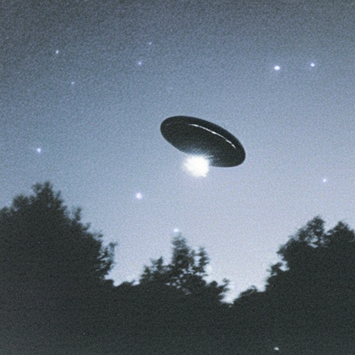

# Proof of Concept: Generate Watermarked Images from Pseudorandom Codes

This repository demos watermarking for Stable Diffusion using [pseudorandom
error-correcting codes](https://eprint.iacr.org/2024/235). For details, see the
companion [blog post](TODO).

## Prerequisites

- Python == 3.11 
- rust >= 1.83

### Local Rust Setup

To install Rust use the installer script from the [Rust getting started
guide.](https://www.rust-lang.org/learn/get-started)

### Local Python Step

```
python -m venv .venv  # requirements are tested for Python 3.11
source .venv/bin/activate
pip install -r requirements.txt
```

Note that we have pinned a specific version of `huggingface_hub` in order to
avoid a [bug introduced in a newer
version](https://github.com/easydiffusion/easydiffusion/issues/1851).

The scripts in the sections below use a watermarking key checked in to this
repository. See the section **"Generate Watermarking Keys"** for instructions on
generating watermarking keys.

## Building the Watermarking Codes

This repository contains a Rust crate, `prc` that implements the actual
watermark. We use `maturin` for Python bindings:

```
maturin develop --release -m prc/Cargo.toml
python prc/example.py  # make sure we can run the code
```

## Generate Watermarked Images

The `generator` module generates a watermarked image, and it's corresponding
inverted latent. The watermark is encoded in the initial latent used in the
image generation process.

Both the image generation and inversion pipelines are Stable Diffusion
pipelines. The generation pipeline uses a `DDIM` scheduler and the inversion
pipeline that generates the approximate initial latent (of the generated image)
uses a `DDIM inverse` scheduler. 

**Generate Watermarked Image from the Prompt:** *grainy photo of a UFO at night*
```
python generator.py --prompt "grainy photo of a UFO at night"
```

**Original Generated Image**



## Verifying Watermarked Images

The watermark verifier allows you to check an image for a watermark added to
images generated by the `generator`. The verifier is implemented by the
`verifier` module.

To run `verifier`, pass it the path of an image you want to check
for a watermark. The verifier can only verify watermarks added to images by
the `generator`. The image must have the dimensions of `512x512` to match the
fixed dimensions of the stable diffusion model used in this PoC.

```
python verifier.py --image_path examples/d3c0618bc28d4f869bed43e997674783.png
```

## Performance Evaluation

To determine how "robust" we need to make the pseudorandom code in order to use
DDIM inversion to recover watermarks, we need to understand how similar the
original initial latent are with the approximate latent. This is provided by
the evaluator module, which generates an unwatermarked image and compares the
initial latent to the inverted latent:

```
python evaluator.py --prompt "grainy photo of a UFO at night"
```

## Generate Watermarking Keys

This writes a file called `watermarking_key` to the current directory, which is
read by the watermark generator and detector. This only needs to be done once.

```
python key_gen.py
```

## Troubleshooting

There is a bug Apple M1/M2 specific bug where running Stable Diffusion pipelines
in debug mode in PyCharm with the `mps` as the targeted device raises the
assertion error below. This error does not happen when `mps` is the target
device and the debug generator, evaluator and detector modules are run from the
command line. To debug in PyCharm set the `debug` command line parameter to
`True` to set the target device to the CPU.

```
IOGPUMetalCommandBuffer validate: failed assertion commit an already committed command buffer
```
